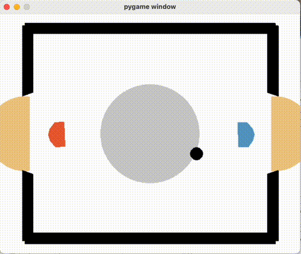

# Laser Hockey Reinforcement Learning Challenge

In this repository, we outline our team's entry for solving the Laser Hockey challenge, which is part of the final project for the Reinforcement Learning course at the University of Tuebingen (Germany).
The Laser Hockey OpenAI Gym environment simulates the popular air hockey game as computer game. The objective is similar too many two player fields game: Score goals but defend your own goal. The underlying mechanics and the general big state space makes the environment a non-trival environment to learn and master. Rewards are sparse in general e.g. score goals. In the base environment an additional reward for ’puck closeness’ is already added. Using gym wrappers the state space, action space and the rewards can further be modified.
By leveraging reinforcement learning, we develop agents which successfully learn the underlying dy- namics and consistently defeat built-in bot opponents.

The algorithms developed by the authors are:

1. **Deep Deterministic Policy Gradient (Jungi Hong) 
2. **Soft Actor-Critic (Till Koepff)

**An extensive report** containing detailed algorithm descriptions, ablation/sensitivity studies on the model's 
hyperparameters, and tricks that played an important role in helping us win the challenge could be found 
[here](assets/RL_Course_2024_25__Final_Project_Report.pdf).